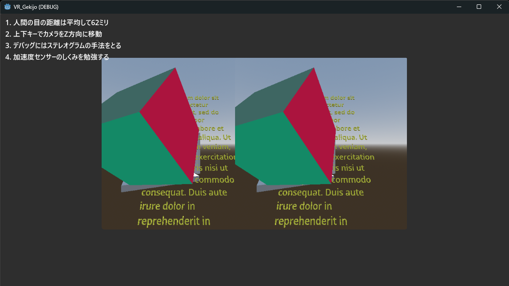

# GOAL

Create a VR framework with Godot Engine. 

## Tasks

+ To Make VR
    - Find how to access accelerator axis 
    - know how gyro-sensor works 
    - gyro-sensor and accleratometer is packaged in a chip (WOW)
    - How do I convert the raw values into quaternion? 
+ Some Spices 
    - Make Education resource not only for fun but for my job
    - Check due-diligence before forking this project 

# Note

とりあえず、デバッグ中は並行視で確認する

+ ステレオグラムの見方はWikipediaを参照のこと-> [ステレオグラム](https://ja.wikipedia.org/wiki/%E3%82%B9%E3%83%86%E3%83%AC%E3%82%AA%E3%82%B0%E3%83%A9%E3%83%A0)
